# How Intel Makes Chips
## Sand to Ingot
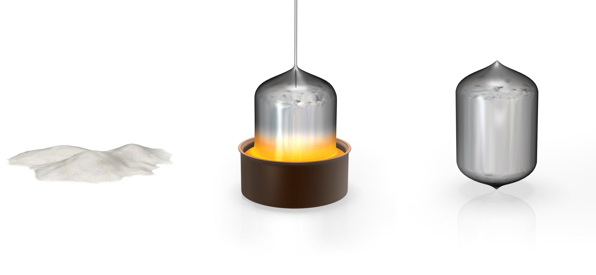
 ### 1. Sand
  Sand has a high percentage of silicon -the starting material for computer chips. Silicon is a ***semiconductor***, meaning that it can be turned into an excellent conductors or insulator of electricity with minor amounts of impurities added.
 ### 2. Melted Silicon
 Silicon is purified to less than one alien atom per billion. It is melted and coooled into a solid crystal lattice cylinder, called an ingot.

 ### 3. Monocystalline Silicon Ingot
 The ***silicon ingot*** has a diameter of 300 millimeters (mm) and weighs about 100 kilograms (kg).
## Ingot to Wafer
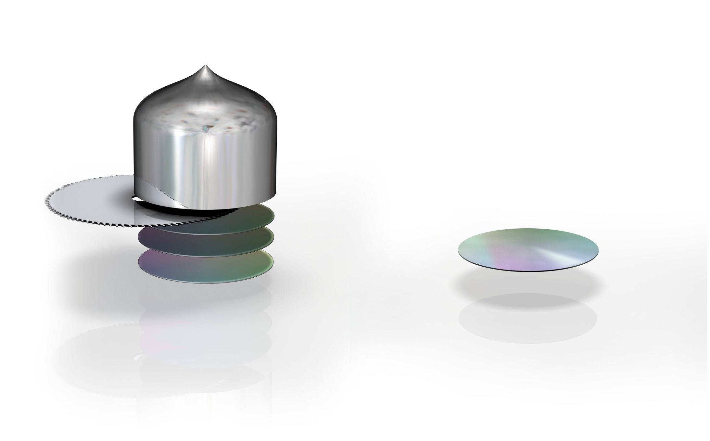
   ### 1. Slicing Ingots
   The ingot is cut into individual silicon discs called wafers. Each wafer is about one mm thick.
   ### 2. Polishing Wafers
   The wafers are polished to a flawless, mirror-smooth surface. Intel buys these manufacturing-ready wafers.
## Photolithography
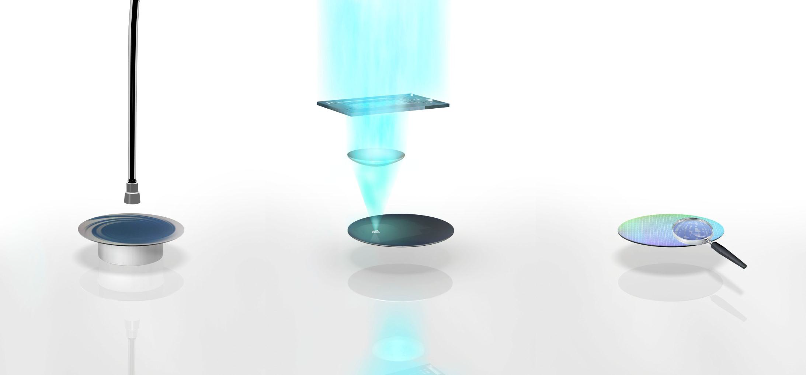
  ### 1. Applying Photoresist
  Photolithography is a process that imprints a specific pattern on the water. It starts by applying a light-sensitive, etch-resistant material called ***photoresist*** onto the wafer surface.
  ### 2. Exposing Photoresist
  The photoresist is hardened and parts of it are exposed to ultraviolet light, making it soluble. The light passess through a mask (similar to stencil), and then through a lens to shrink and print circuit patterns on each layer of every chip on the ***wafer***.
  ### 3. Developing Resist
  A chemical process removes the soluble photoresist, leaving a patterned photoresist image as determined by what was on the mask.
## Ion Implantation
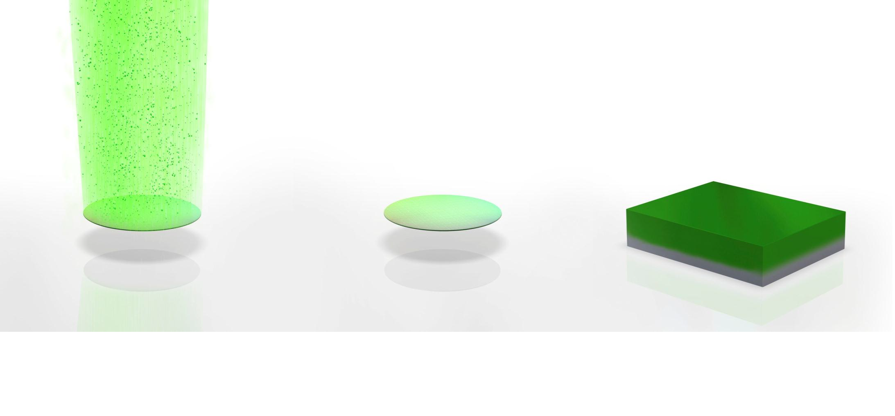
  ### 1. Implanting Ions
  Ions (positively or negatively charged atoms) are embedded beneath the surface of the wafer in regions not covered by photoresist. This alters the conductive properties of the silicon in selected locations.
  ### 2. Removing Photoresist
  After the ion implanation, the photoresist is removed, resulting in certain regions being doped with alieon atoms.
  ### 3. The Transistor
  Although hundreds of chips are usually built on a single wafer, the next steps focus on a small piece of chip - a stransistor.
## Etching
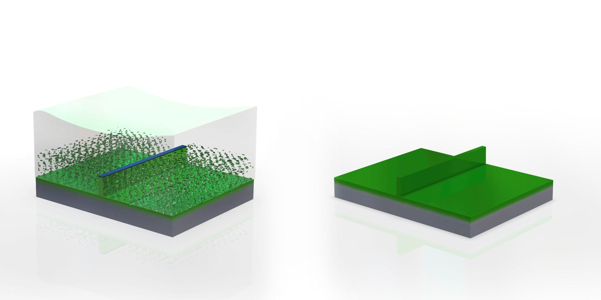
  ### 1. Etching
  To create a fin for a tri-gate transistor, Intel applies a hard mask material using photolithography. Then a chemical is applied to ***etch** away unwanted silicon, leaving behind a fin with a layer of hard mask on top.
  ### 2. Removing Hard Mask
  The hard mask is chemically removed, leaving a tall, thin silicon fin that will contain the ***channel** of a transistor.
## Temporary Gate Formation
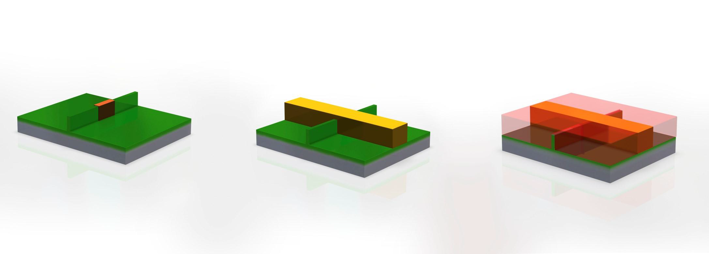
  ### 1. Creating a Gate Dielectric
  Photoresist is applied to portions of the transistor, and a thin silicon dioxide layer is created by inseting the wafer in an oxygen-filled tube-furnace. This layer becomes a temporary ***gate dielectric***.
  ### 2. Creating a Gate Electrode
  Using photolithography, a temporary layer of ***polycrystalline silicon* is created. This becomes a temporary gate electrode.
  ### 3. Insulating the Transistor
  In another oxidation step, a silicon dioxide layer is created over the entire wafer to insulate the transistor from other elements.
## "Gate-Last" High-k/Metal Gate Formation
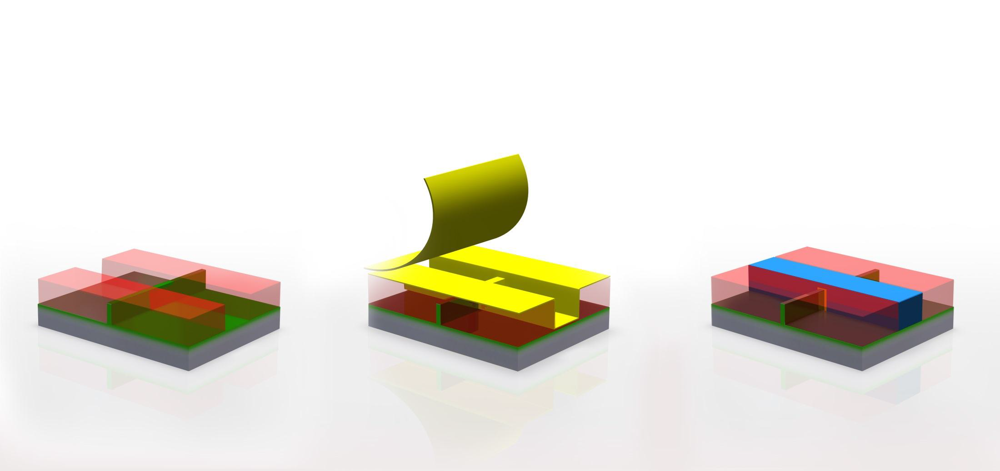
 ### 1. Removing the Temporary Gate
 The temporary gate electrode and gate dielectric are etched way in preparation for forming the final gate. This procedure is called gate-last.
 ### 2. Applying High-k Dielectric Material
 Mutiple layers of ***high-k dielectric material*** are applied to the wafer surface using a method called atomic layer deposition. This material is etched away in some areas, such as the silicon dioxide layer.
 ### 3. Forming a Metal Gate
 A metal gate electrode is formed over the wafer and removed from regions other than the gate electrode. This combination of this and the high-k dielectric material imporoves performance and reduces leakage.
## Metal Deposition
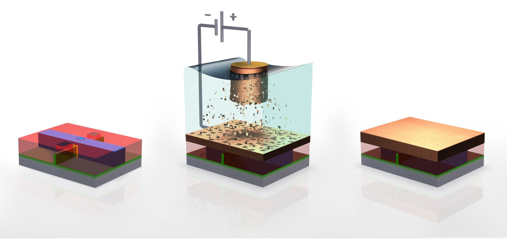
 ### 1. Preparing to Connect the Transistor
 Three holes are etched into the insulation layer above the transistor. The holes are filled with copper or another materia that creates metal connections to other transistors.
 ### 2. Electroplating
 The wafers are put into a copper sulphate solution. Copper ions are deposited onto the transitors using a process called electroplating.
 ### 3. After Electroplating
 Copper ions settle as a thin layer of copper on the transistor surface.
## Metal Layers
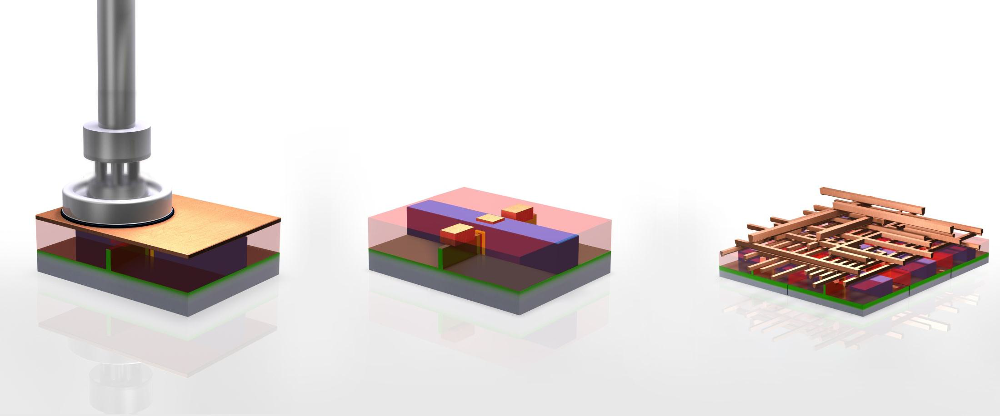
 ### 1. Polishing
 The excess material is polished off, revealing a specific pattern of copper.
 ### 2. Connecting with Metal Layers
 Like a multi-level highway, metal layers interconnect the transistors in a chip (middle and right images.) The design of the chip determines how he connection are made. Although chips look flat, they can have more than 30 layers of this complex
 circuitry.
## Wafer Sort Test and Singulation
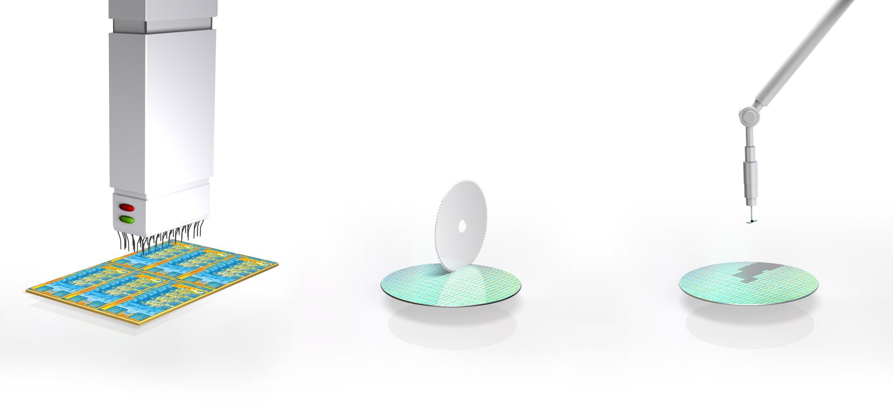
 ### 1. Sort Testing
 After wafer processing is completed, each chip on a wafer is tested for its functionality.
 ### 2. Slicing Wafers
 The wafer is cut into pieces called die.
 ### 3. Moving to Packaging
 Based on the responses received in the ***wafer sort*** test, die are selected for packaging.
## Packaging Die
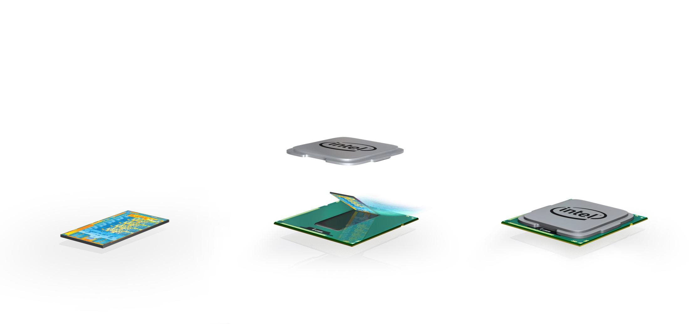
 ### 1. Individual Die
 The individual die which have been cut out in the previous step singulation).
 ### 2. Packaging
 The substrate, the die, and a heat spreader are put together to form a completed processor. The green substrate creates the electrical and mechanical connections so that the processor can interact with the system. The silver-colored heat spreader is a thermal interface that helps dissipate heat.
 ### 3. Completed Processor
## Class Testing and Completed Processor
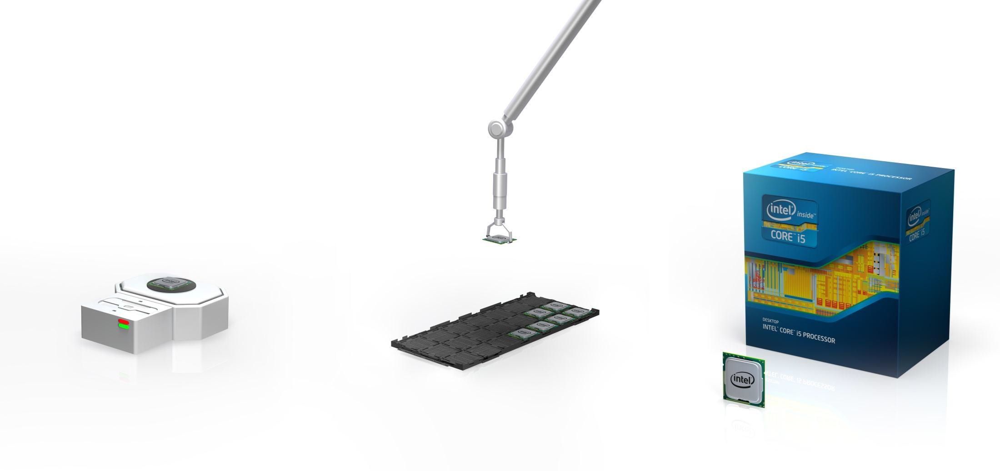
 ### 1. Package Testing
 Processors undergo final testing for functionality, performance, and power
 

   
